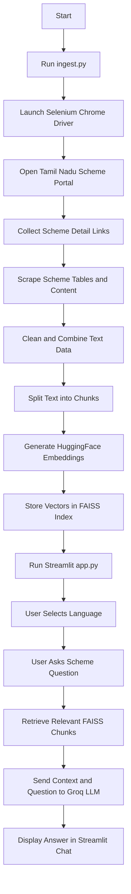

# Tamil Nadu Agriculture Scheme AI Assistant

An AI-powered Streamlit application that helps users ask questions about Tamil Nadu Government agriculture schemes. The app scrapes official scheme data, stores it in a local FAISS vector database, and uses a Retrieval-Augmented Generation (RAG) pipeline to answer user questions in English or Tamil.

## Features

- Scrapes Tamil Nadu Government agriculture scheme pages using Selenium and BeautifulSoup.
- Extracts structured scheme details from official portal tables.
- Splits scraped content into searchable text chunks.
- Creates a local FAISS vector database using HuggingFace embeddings.
- Uses Groq LLM through LangChain for RAG-based answers.
- Supports English and Tamil language modes.
- Provides a Streamlit chat interface with an image carousel.

## Project Structure

```text
.
├── app.py              # Streamlit user interface
├── core.py             # RAG chain and LLM logic
├── ingest.py           # Web scraping and FAISS index creation
├── README.md           # Project documentation
└── faiss_agri_index/   # Generated vector database after running ingest.py
```

## Workflow Diagram



## Technology Stack

- Python
- Streamlit
- Selenium
- BeautifulSoup
- LangChain
- HuggingFace Embeddings
- FAISS
- Groq LLM
- webdriver-manager

## Prerequisites

Install Python 3.10 or later.

Create a Groq API key from the Groq Console and store it in a `.env` file.

## Installation

Clone the repository:

```bash
git clone https://github.com/your-username/your-repository-name.git
cd your-repository-name
```

Create and activate a virtual environment:

```bash
python -m venv venv
```

On Windows:

```bash
venv\Scripts\activate
```

On macOS or Linux:

```bash
source venv/bin/activate
```

Install dependencies:

```bash
pip install streamlit python-dotenv beautifulsoup4 selenium webdriver-manager langchain langchain-community langchain-core langchain-groq langchain-huggingface langchain-text-splitters faiss-cpu sentence-transformers
```

## Environment Variables

Create a `.env` file in the project root:

```env
GROQ_API_KEY=your_groq_api_key_here
```

## How to Run

First, run the ingestion script to scrape data and create the FAISS vector database:

```bash
python ingest.py
```

After the vector database is created, start the Streamlit app:

```bash
streamlit run app.py
```

Open the local URL shown in the terminal, usually:

```text
http://localhost:8501
```

## How It Works

1. `ingest.py` opens the Tamil Nadu Government scheme portal using Selenium.
2. It collects all available scheme detail links from the agriculture department page.
3. Each scheme page is scraped and converted into clean text.
4. The text is split into chunks using `RecursiveCharacterTextSplitter`.
5. HuggingFace embeddings convert the text chunks into vectors.
6. FAISS stores the vectors locally in `faiss_agri_index`.
7. `core.py` loads the FAISS index and builds a LangChain RAG pipeline.
8. `app.py` provides a Streamlit chat interface for users.
9. User questions are matched with relevant scheme chunks.
10. Groq LLM generates a clear answer based only on the retrieved context.

## Important Notes

- Run `python ingest.py` before starting the Streamlit app.
- The generated `faiss_agri_index` folder is required for the chatbot to answer questions.
- Keep your `.env` file private and do not push it to GitHub.
- If the official portal structure changes, the scraping logic in `ingest.py` may need updates.

## Suggested `.gitignore`

```gitignore
.env
venv/
__pycache__/
*.pyc
faiss_agri_index/
```

## Example Questions

- What schemes are available for farmers?
- Explain seed subsidy schemes.
- How can farmers avail agriculture training support?
- What financial assistance is available for agriculture development?

## License

This project is intended for educational and informational use.
